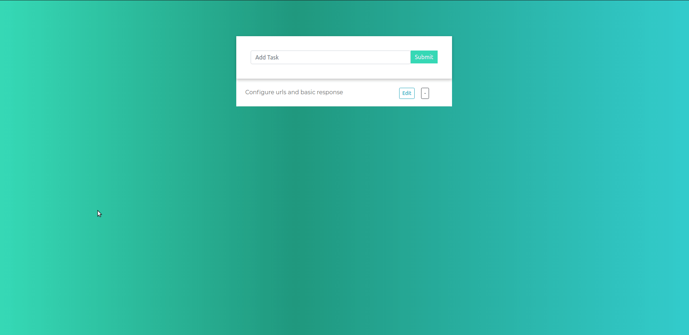

# To-Do App

To-Do App is a Django + React project that has CRUD operations (create, read, update and delete). It is backed with [Django Rest Framework](https://www.django-rest-framework.org/).

### Installation
```sh
$ git clone https://github.com/apoorva-2812/TO-DO-APP.git
$ cd TO-DO-APP/todo_drf
$ virtualenv env
$ source env/bin/activate
$ pip install -r requirements.txt
$ python manage.py runserver
```
The app is now accessible on <http://127.0.0.1:8000/>

### Demo
